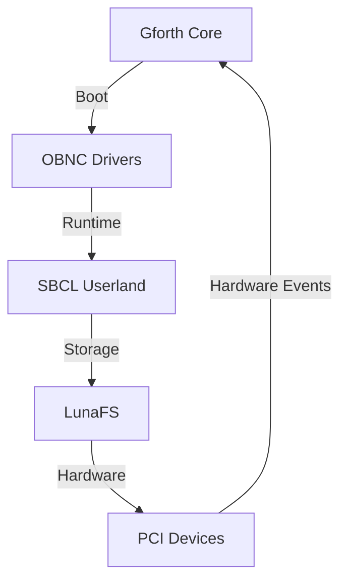

# Lunaviel Core Kernel Development Plan
**Owner:** Dae Euhwa
**Organization:** Veridian Zenith
**Last Updated:** Wed 02 July 2025 07:56
**Target Hardware:** HP ProBook 450 G9 (12th Gen Intel Core i3-1215U, Alder Lake-U)
**Architecture:** x86_64 with 39-bit physical, 48-bit virtual addressing
**Current Status:** PCI enumeration in progress, core architecture complete

## Contributors
| Name | Role | Contact |
|------|------|---------|
| Dae Euhwa | Lead Developer | daedaevibin@naver.com |

## Development Timeline

### Phase 1: Core System (Completed)
| Task | Completion Date | Technical Details |
|------|-----------------|-------------------|
| Project Structure | Di 10 Juni 2025 | UEFI-first boot, Forth shell foundation |
| Core Architecture | Do 12 Juni 2025 | Paging, IDT, interrupt handling, heap management |
| Driver Framework | Fr 13 Juni 2025 | OBNC driver structure with Lisp hooks |

### Phase 2: Hardware Integration (In Progress)
| Task | Target Date | Status | Technical Focus |
|------|------------|--------|----------------|
| PCI Enumeration | Do 19 Juni 2025 | In Progress | Device detection, IRQ routing |
| NVMe SSD Driver | Fr 20 Juni 2025 | In Progress | Kioxia BG5 controller support |
| Ethernet Driver | Sa 21 Juni 2025 | In Progress | RTL8168 controller implementation |
| WiFi Driver | So 22 Juni 2025 | In Progress | RTL8852BE firmware handling |
| Audio Driver | Mo 23 Juni 2025 | In Progress | Intel SOF integration |
| Camera Driver | Mo 23 Juni 2025 | In Progress | Quanta UVC support |
| Bluetooth | Di 24 Juni 2025 | In Progress | Realtek USB implementation |
| USB/Thunderbolt | Mi 25 Juni 2025 | In Progress | xHCI controller support |
| ACPI/Battery | Mi 25 Juni 2025 | In Progress | Thermal management |
| Graphics | Do 26 Juni 2025 | In Progress | Intel UHD framebuffer |

### Phase 3: System Services
| Task | Target Date | Status | Technical Focus |
|------|------------|--------|----------------|
| LunaFS | Fr 27 Juni 2025 | In Progress | NVMe-native filesystem |
| FAT Support | Fr 27 Juni 2025 | In Progress | UEFI boot compatibility |
| Logging | Sa 28 Juni 2025 | In Progress | Serial/Forth ringbuffer |
| Scheduler | So 29 Juni 2025 | In Progress | OBNC cooperative tasks |
| Syscalls | Mo 30 Juni 2025 | In Progress | OBNC-Lisp interface |
| Userland Loader | Di 01 Juli 2025 | Planned | SBCL stub loader |
| QEMU Testing | Di 01 Juli 2025 | Planned | Automated test framework |
| Hardware Bring-up | Mi 02 Juli 2025 | Planned | Real device testing |

## Technical Architecture

## Current Focus Areas

1. **PCI Enumeration Completion**
   - Finalize device detection for all bus devices
   - Implement proper IRQ routing and resource allocation
   - Test with NVMe, Ethernet, WiFi, and USB controllers

2. **Driver Development**
   - Complete NVMe driver with async I/O support
   - Implement network stack for Ethernet/WiFi
   - Develop power management framework

3. **Filesystem Implementation**
   - Finalize LunaFS block layer using NVMe driver
   - Implement journaling and snapshot capabilities
   - Add FAT read-only support for UEFI boot

## Next Steps

1. Complete PCI enumeration testing (Priority)
2. Finalize NVMe driver implementation
3. Develop hardware test suite
4. Implement core system services

## Code References
- Kernel Core: `src/core/boot.fth`
- Drivers: `src/drivers/*.obn`
- Filesystem: `src/fs/lunafs.obn`
- Userland Init: `src/user/init.lisp`

**Technical Notes:**
- All components designed for 12th Gen Intel Core architecture
- Memory management optimized for 39-bit physical addressing
- Driver development follows strict OBNC module interfaces
- Filesystem designed for Kioxia NVMe SSD characteristics
