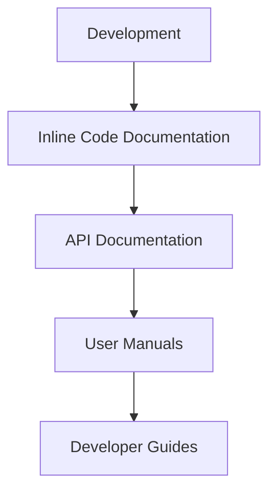

# Lunaviel Core Kernel Development Plan
**Owner:** Dae Euhwa
**Organization:** Veridian Zenith
**Last Updated:** Mi 02 Juli 2025 07:52
**Target Hardware:** HP ProBook 450 G9 (12th Gen Intel Core i3-1215U, Alder Lake-U)
**Architecture:** x86_64 with 39-bit physical, 48-bit virtual addressing
**Current Status:** PCI enumeration in progress, core architecture complete

## Contributors
| Name | Role | Contact |
|------|------|---------|
| Dae Euhwa | Lead Developer | daedaevibin@naver.com |

## Documentation Plan


### Documentation Components
1. **Inline Documentation**
   - Complete code comments for all functions
   - Parameter and return value documentation
   - Usage examples in header comments
   - Target: 100% coverage of public interfaces

2. **API Documentation**
   - Structured reference for all system calls
   - Driver interface specifications
   - Hardware abstraction layer documentation
   - Format: Markdown with consistent structure

3. **User Manuals**
   - System administration guide
   - Configuration reference
   - Troubleshooting guide
   - Target audience: System administrators

4. **Developer Guides**
   - Architecture overview
   - Driver development guide
   - Porting guide for new hardware
   - Contribution guidelines

### Documentation Timeline
| Component | Duration | Responsible |
|-----------|----------|-------------|
| Inline Docs | Ongoing | Developers |
| API Reference | 3 days | Dae Euhwa |
| User Manual | 5 days | Dae Euhwa |
| Developer Guide | 7 days | Dae Euhwa |

## Development Timeline

```

## Current Focus Areas

1. **PCI Enumeration Completion**
   - Finalize device detection for all bus devices
   - Implement proper IRQ routing and resource allocation
   - Test with NVMe, Ethernet, WiFi, and USB controllers

2. **Driver Development**
   - Complete NVMe driver with async I/O support
   - Implement network stack for Ethernet/WiFi
   - Develop power management framework

3. **Filesystem Implementation**
   - Finalize LunaFS block layer using NVMe driver
   - Implement journaling and snapshot capabilities
   - Add FAT read-only support for UEFI boot

## Next Steps

1. Complete PCI enumeration testing (Priority)
2. Finalize NVMe driver implementation
3. Develop hardware test suite
4. Implement core system services

## Code References
- Kernel Core: `src/core/boot.fth`
- Drivers: `src/drivers/*.obn`
- Filesystem: `src/fs/lunafs.obn`
- Userland Init: `src/user/init.lisp`

**Technical Notes:**
- All components designed for 12th Gen Intel Core architecture
- Memory management optimized for 39-bit physical addressing
- Driver development follows strict OBNC module interfaces
- Filesystem designed for Kioxia NVMe SSD characteristics
